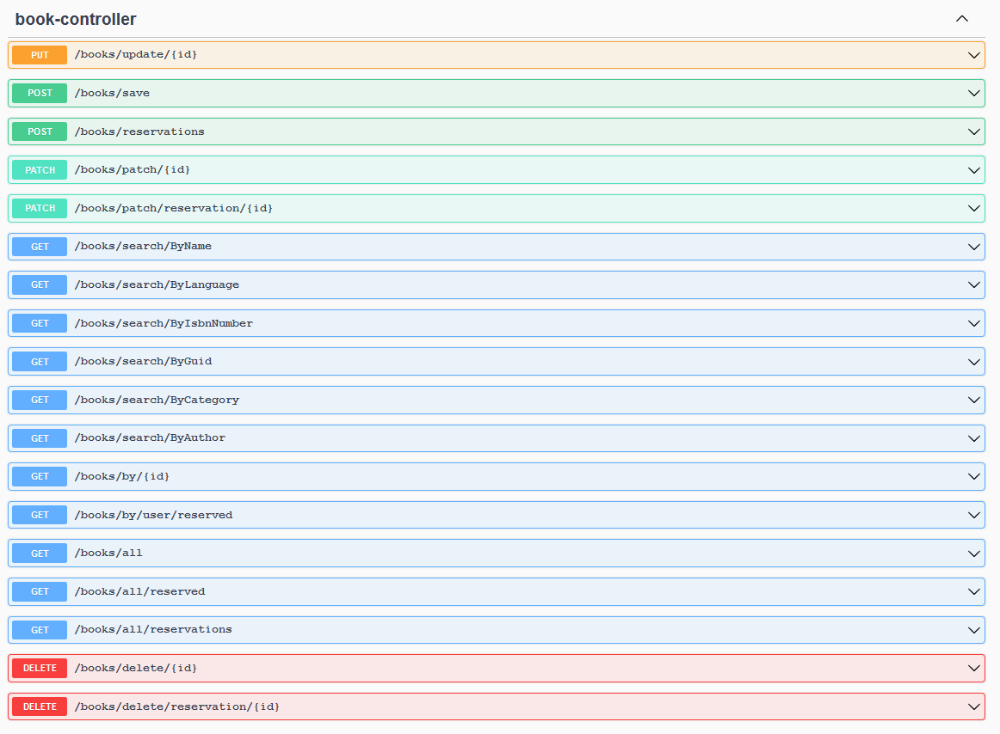
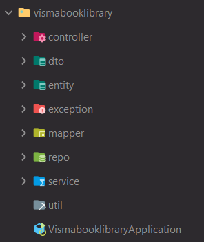

# 1. Introduction
This is a Spring framework made Visma's Book Library API Service. Main works include:
Used Spring framework to support "Visma's Book Library API" search by book or user, listing, update, delete book, 
create/update/delete book reservation. Utilized Hibernate,
Spring JPA to provide better support of database operations.
Back-end:
* Spring Boot
* Hibernate
* JPA
* Lombok
* H2 database
* Mapstruct
* Swagger

## 2. Documentation API (Swagger) by accessing
- `http://localhost:8080/api/v1.0/swagger-ui.html`

## 3. Project Structure
Created the folders we'll need for implementing project.In the main package `debarz.vismabooklibrary` are
packages according too functionality:
- `controller` package: includes REST controllers. Spring RestController takes care of mapping request data
  to the defined request handler method.
- `dto` package: includes A Data Transfer Object classes. Is an object that is used to encapsulate data,
  and send it from one subsystem of an application to another.
- `exception` package: includes exception classes. It is for send message in response that object was not found in database.
- `mapper` package: includes mapper classes. It is for map entity to dto or vice versa.
- `entity` package: includes entities classes. Entity class is a POJO (Plain Old Java Object) class, i.e. an ordinary
  class that is marked (annotated) as having the ability to represent objects in the database.
- `repo` package: includes repository interfaces that extends JPA repository. it contains API
  for basic CRUD operations and also API for pagination and sorting.
- `service` package: includes services classes, it is app functionality classes.

## H2 Console
- `http://localhost:8080/api/v1.0/h2`
- `jdbc:h2:mem:bookLibraryApp`
- username: `db`
- password: `db`

